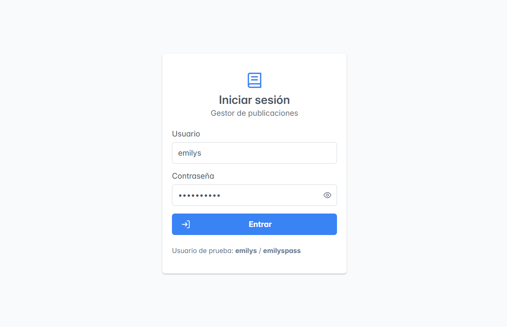
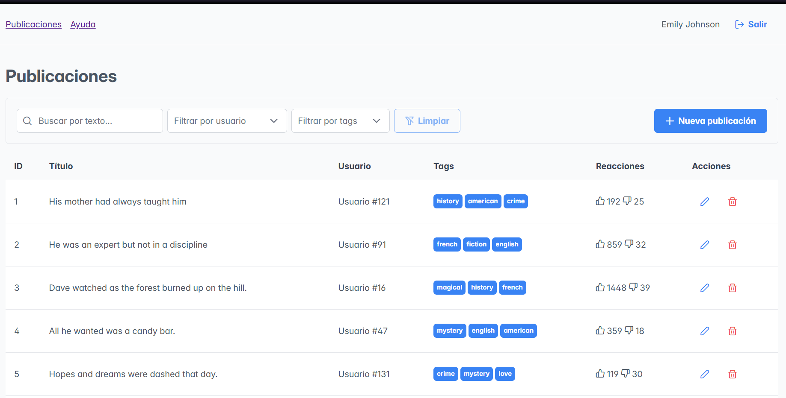
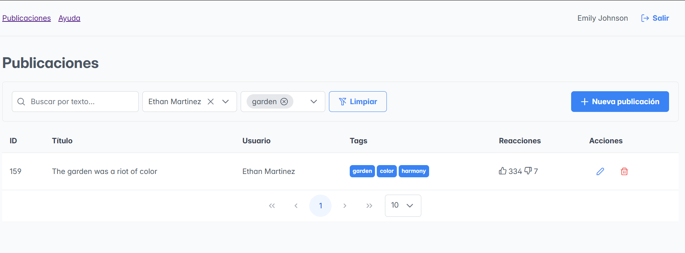
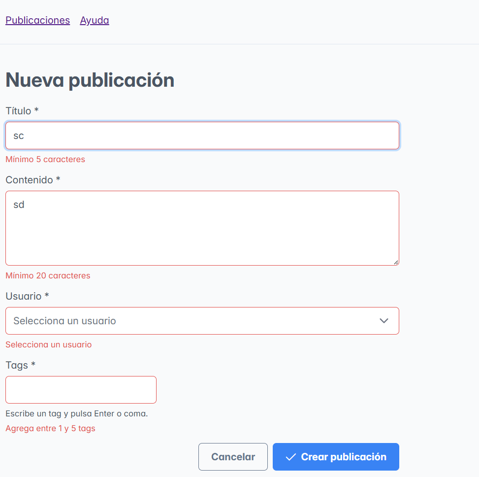
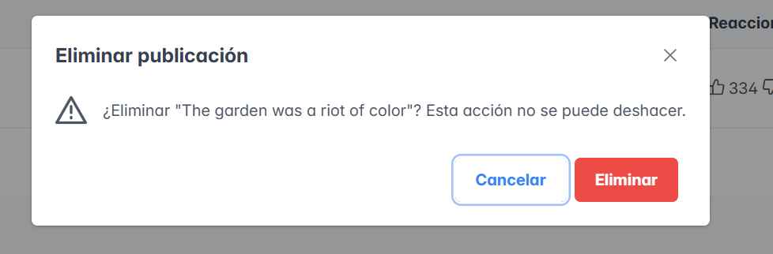
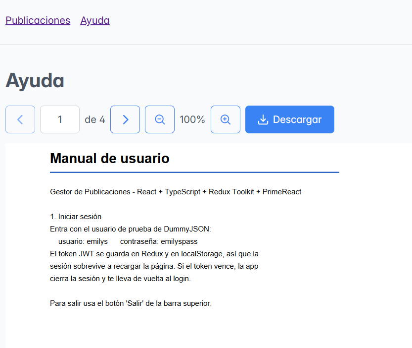

# Gestor de Publicaciones

Es donde se hace el CRUD y se pueden visualizar los datos
Esta hecho con React y Redux

## Cómo correrlo

```bash
npm install
npm run dev     # abre http://localhost:5173
npm test        # corre los tests
npm run build   # build de producción
```

Usuario de prueba: `emilys` / `emilyspass`.
El usuario del enunciado (`kminchelle`) ya no existe en DummyJSON: la API responde "Invalid credentials".

## Capturas

| Login                                   | Tabla                                   | Filtros                                     |
| --------------------------------------- | --------------------------------------- | ------------------------------------------- |
|  |  |  |

| Formulario                                        | Eliminar                                      | PDF                                 |
| ------------------------------------------------- | --------------------------------------------- | ----------------------------------- |
|  |  |  |

## Qué está hecho

- Login con token guardado en Redux y localStorage
- Rutas protegidas: sin token te manda a /login
- CRUD
- Visor de PDF en /docs (react-pdf): navegación entre páginas, ir a una página, zoom y descarga
- ESLint, Prettier

## Estructura del proyecto

- `api/`: funciones que llaman a DummyJSON. No saben nada de Redux.
- `features/`: un slice de Redux por tema (auth, posts, users, ui).

## Decisiones técnicas

- ¿Por qué separé api/ de Redux? Separé api/ de Redux para que la capa de datos no dependa del estado: si cambio Axios por fetch solo toco api/, y en los tests puedo simular las llamadas.
- ¿Por qué el token se guarda con un listener y no en el reducer? El token se guarda porque reducers deben ser puros; localStorage es un efecto secundario
- ¿Por qué la tabla despacha setPage y no fetchPosts? Una sola fuente de verdad la query y un solo lugar que pide datos
- ¿Por qué debounce en la búsqueda? Evitar una petición por tecla, el 429 y el parpadeo
- ¿Cómo combiné filtros si la API no lo permite? Se pide el filtro más selectivo, se filtra el resto en el cliente con .filter() y se pagina con .slice()
- ¿Por qué el borrado es optimista? La fila desaparece al instante y, si falla, se restaura con el post completo guardado en removed

## Problemas que encontré y cómo los resolví

- El usuario de prueba del enunciado ya no existe
- El post creado desaparecía al volver a la tabla → loadedQuery
- DummyJSON no guarda los posts nuevos, PUT /posts/252 no lo encuentra, marque los posts creados como isLocal y para esos, actualizo solo Redux sin llamar a la API

## Pendiente / qué haría con más tiempo

- Editar al recargar la página: hoy el formulario solo encuentra el post si viene de la tabla (habría que pedir GET /posts/:id).
- Conservar los cambios al cambiar de página: DummyJSON no guarda nada, así que al cambiar de página o recargar se pierden los posts creados o editados.
- Más tests: reducers de posts, filtros y componentes.
